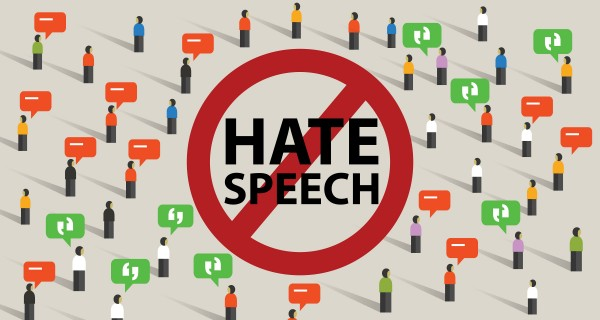

# Hate speech and offensive language detection

A hate speech is any form of expression through which speakers intend to vilify, humiliate, or incite hatred against a group or a class of people on the basis of race, 
religion, skin color, sexual identity, gender identity, ethnicity, disability, or national origin.

The aim of this project is to use a dataset of 25.000 labelled tweets (as hate speech, offensive language, or neither of that), and to train a model on them to then be 
able to classify new data in one of these three classes. Then, integrate the model into a web application that can take a sentence as input from the user and classify it.

The project is divided into:
- [Jupyter Notebook](Hate%20%speech%20%and%20%offensive%20%language%20%detection.ipynb) in Python with commented code with all the algorithms on the different datasets used.
- [Dash App](dash%20%app) code in Python
- Project [presentation](Presentation.pptx)
- [Web application](https://hate-speech-automatic-detector.herokuapp.com/) deployed on Heroku

